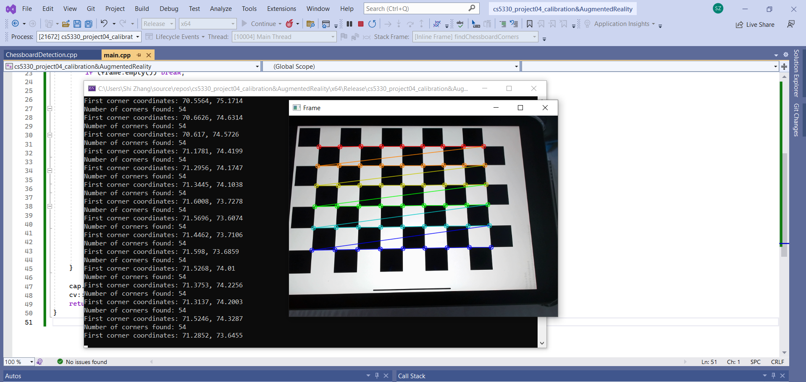
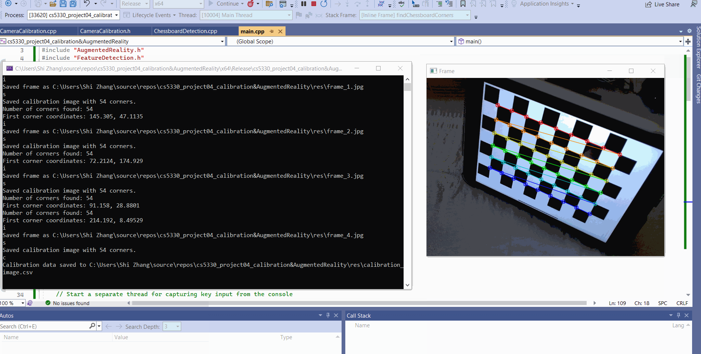
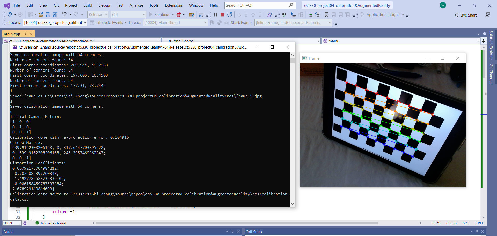
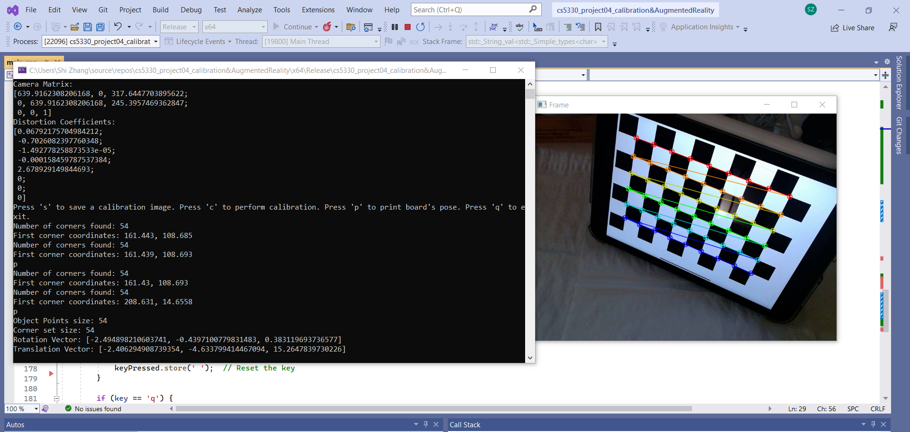
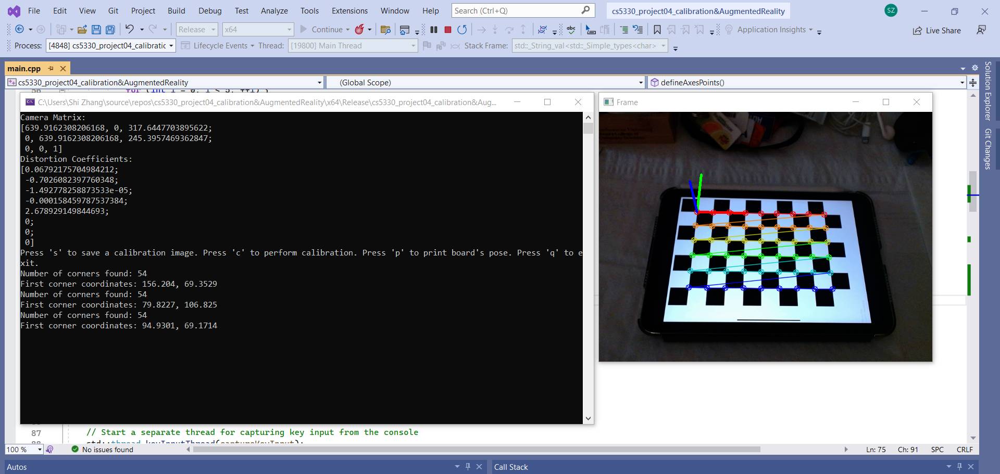
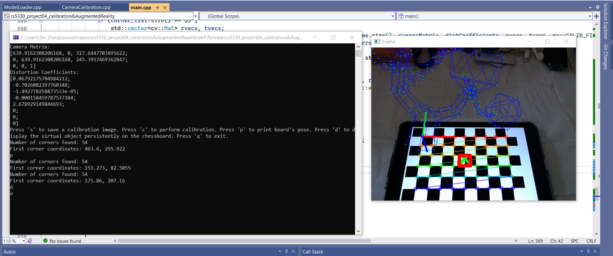
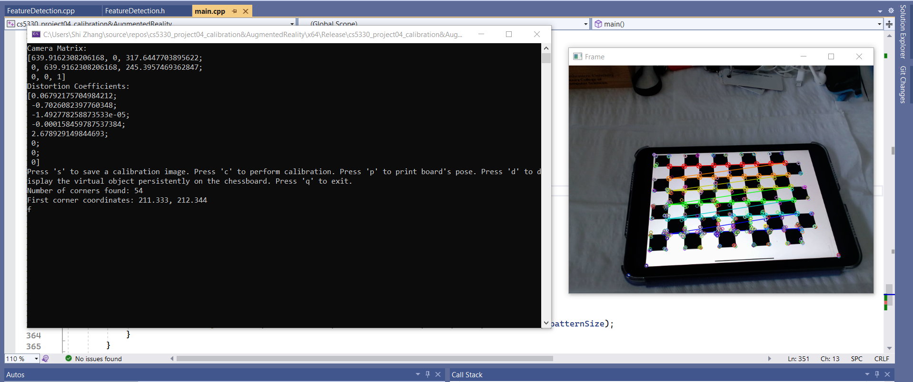
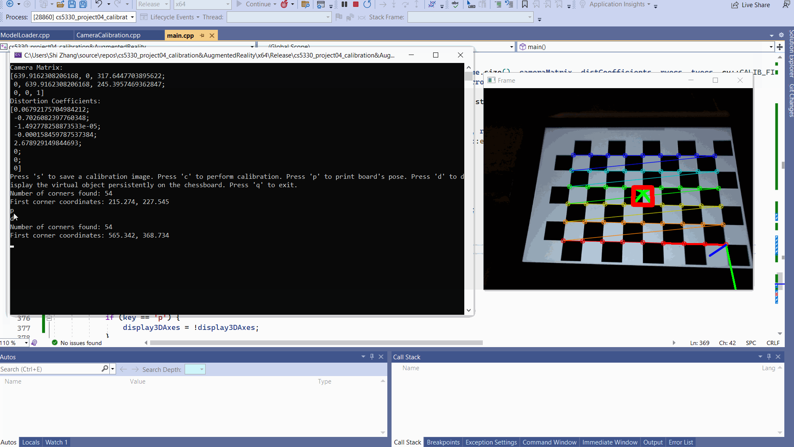
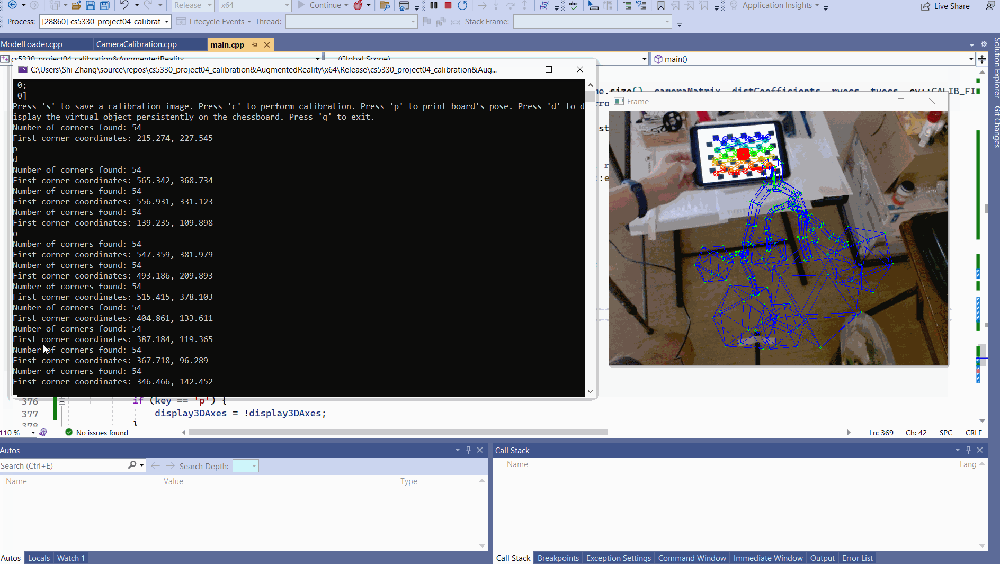

# CS5330 Computer Vision Project: Real-Time Augmented Reality

CS5330 Pattern Recognition & Computer Vision

NEU 2023 Fall

Instructor: Bruce Maxwell

Student: Shi Zhang

## Project Report

### 1. Introduction

This project aims to develop a system capable of performing real-time augmented reality by detecting a chessboard pattern, calibrating the camera based on that pattern, and overlaying virtual objects onto the live video feed. The system follows a step-by-step approach, starting with corner detection and extraction, selecting calibration images, calibrating the camera, and finally augmenting virtual objects based on the current position of the camera.

---

### 2. Visual Demonstrations

- **Task 1: Chessboard Corner Detection**

  

  *Image showing detected chessboard corners with their coordinates.*

  The system initiates the augmented reality pipeline by detecting chessboard corners within the video feed. Utilizing OpenCV's findChessboardCorners and cornerSubPix, it identifies and refines the corner locations to sub-pixel accuracy. Detected corners are visually represented in the image, and the coordinates of the first corner, typically located at the upper left of the chessboard, are outputted to aid in debugging and verification.

- **Task 2: Calibration Images Selection**

  

  *Image showing a selected calibration image with highlighted chessboard corners.*

  Upon successful chessboard detection, the user can select an image for calibration using the 's' key. The system captures and stores the 2D image points and the corresponding 3D world points in a consistent coordinate system. The calibration process utilizes a collection of these points to compute the camera's intrinsic and extrinsic parameters, essential for accurate 3D rendering in augmented reality applications.

- **Task 3: Camera Calibration and Error Estimation**

  

  *Output showing the camera matrix, distortion coefficients, and re-projection error.*

  After the board pattern is recognized, cv::calibrateCamera is implemented to calibrate the camera. The calibration process iteratively refines the camera matrix and distortion coefficients to minimize the re-projection error, which typically ranges between 0.1 and 0.2, depending on factors such as lighting and the flatness of the board surface. Post-calibration, the user can save the calibration data by pressing 's', resulting in the camera parameters being persisted to <repo>/res/calibration_data.csv.

- **Task 4: Real-Time Camera Position**

  

  *Display of the camera's rotation and translation data in real-time.*

  With the calibration data in hand, the system then enters a video loop, where it attempts to detect the chessboard in each frame. When found, it captures the corner locations and employs solvePnP to estimate the chessboard's pose relative to the camera. This real-time computation of the board's rotation and translation vectors is essential for overlaying virtual objects accurately onto the live video stream.

- **Task 5: Projection of 3D Axes**

  

  *Image showing the projection of 3D axes onto the chessboard.*

  Building upon the pose estimation, the system uses projectPoints to visually represent the spatial orientation of the chessboard by projecting 3D axes onto the image plane. This real-time projection tracks the movements of the chessboard, or the camera itself, offering a visual confirmation of the accuracy of the pose estimation.

- **Task 6: Virtual Object Augmentation**

  

  *Image displaying a virtual object augmented onto the live video feed.*

  The culmination of the system's capabilities is the overlay of virtual objects onto the live video feed. With the camera calibrated and the chessboard's pose known, the system constructs a virtual object in 3D space and projects its image onto the 2D plane of the video feed. This ensures that the virtual object maintains the correct orientation and scale as the camera moves, providing a convincing augmented reality experience.

- **Task 7: Feature Detection Demo**

  

  *Image demonstrating the detection of robust features on a pattern.*

  Separate from the main augmented reality application, a robust feature detection module analyzes video frames to locate and highlight features such as corners or distinctive patterns. This process, using algorithms like ORB detector, enables the system to recognize and track these features in real-time, which could be leveraged for more advanced augmented reality applications where traditional markers like chessboards are not feasible.

---

### 3. Extensions

- **Creative Virtual Objects and Multi-Target Support**
  
  In this program, the user is allowed to draw a virtual object, such as a virtual pyramid on the chessboard by pressing 'd'. Or load an OBJ format 3D model locally by pressing 'o'.

  Below is the initial tiny 3D pyramid drawn on the chessboard with 'd' pressed.

  

  Below is a local low-poly tree loaded on the chessboard with 'o' pressed. Both virtual objects can be displayed at the same time.

  

  Below is the video demonstration for multiple virtual objects displayed:

  

---

### 4. Reflection

Getting the virtual objects to show on the chessboard is challenging, as in the beginning, I did not realize it needed to keep showing for every frame in the live video feed. It took me several hours to debug and realize task 6 code should be separated from task 4 and some parameter needs to be global to control the showing state.

Another challenge I tried but failed was getting the virtual object rendered as shaded. Hopefully sometime later I can revisit and manage this feature. 

---

### 5. Acknowledgements

For many of the work present in this assignment, I referred to the sources below:

- [Computer Vision: Algorithms and Applications, 2nd ed. © 2022 Richard Szeliski, The University of Washington](http://szeliski.org/Book/)
- [Visual Recognition Course from University of Toronto, Winter 2012](https://www.cs.toronto.edu/~urtasun/courses/VisualRecognition/visual_recognition.html)
- [Computer Vision Course from University of Toronto, Winter 2013](https://www.cs.toronto.edu/~urtasun/courses/CV/cv.html)
- [Advanced Camera Calibration Technique with C++ and OpenCV: A Practical Guide](https://www.youtube.com/watch?v=E5kHUs4npX4&ab_channel=NicolaiNielsen)
- [OpenGL Course - Create 3D and 2D Graphics With C++](https://www.youtube.com/watch?v=45MIykWJ-C4&ab_channel=freeCodeCamp.org)

For the OBJ 3D model I used in this project, I referred to the link here:
- [Low Poly Tree 3D Model from Free3D website](https://free3d.com/3d-model/low_poly_tree-816203.html)

## Project Running Instructions

#### OpenCV Setup for windows

I used OpenCV 4.6.0 Version for this project. 

Before run the application, you will need to add the Path for environment variables on Windows. 

This step can be referred to this tutorial: [Setup OpenCV in Visual Studio 2022 for C/C++ Development](https://www.youtube.com/watch?v=unSce_GPwto)

#### Project Setup within Visual Studio 2022

##### Step 1: Create a Solution
Open Visual Studio.
Go to File -> New -> Project....
In the Create a new project dialog, choose Empty Project under Installed -> Visual C++.
Name the Solution (e.g., calibration&AugmentedReality) and the Project with the same name and choose a location to save it. Click Create.

##### Step 2: Add the Project Files
In Solution Explorer, right-click on the calibration&AugmentedReality project.
Choose Add -> New Item....
I created and stored the following files under this project to perform all the tasks.
- ChessboardDetection.h
- ChessboardDetection.cpp
- CameraCalibration.h
- CameraCalibration.cpp
- FeatureDetection.h
- FeatureDetection.cpp
- AugmentedReality.h
- AugmentedReality.cpp
- ModelLoader.h
- ModelLoader.cpp
- main.cpp

  To read the camera calibration data from a local path, you may need to download the calibration_data.csv from the res folder and reset the calibrationFilePath under the main program.

  To load the local OBJ 3D model as a virtual object, you may need to download the Lowpoly_tree_sample.obj or Lowpoly_tree_sample2.obj from the res folder and reset the modelPath under the main program.

##### Step 3: Run the Program

Once the application starts, it will display the live video feed from the camera. You can interact with the application using the following key presses:

- Save Calibration Image (s):

When the chessboard is detected in the frame, press s to save the current frame for later calibration. The corners detected in this frame will be added to the calibration dataset.

- Calibrate Camera (c):

Press c after collecting sufficient calibration images (at least 5 are recommended) to start the camera calibration process. The calibration will compute the camera matrix and distortion coefficients, output the re-projection error, and save the calibration data to the specified file path.

- Toggle Display of 3D Axes (p):

Press p to toggle the display of the 3D axes on the chessboard. This will draw axes on the video feed to visualize the orientation of the chessboard in real-time.

- Toggle Display of Virtual Object from a local OBJ file (o):

Press o to toggle the display of the virtual object. This will enable or disable the drawing of the 3D model on the chessboard.

- Display Virtual Object Persistently (d):

Press d to make the virtual object persistently visible on the chessboard, even if the chessboard is not currently detected.

- Display Features (f):

Press f to toggle the display of features on the chessboard. This will enable or disable the feature detection and drawing on the video feed.

- Exit Application (q):

Press q to quit the application. This will exit the program gracefully, ensuring that all resources are properly released.

---

### Time Travel Days

I am not using any travel days for this assignment.
